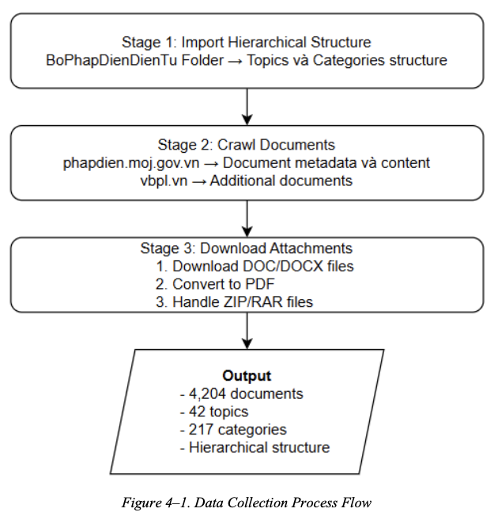
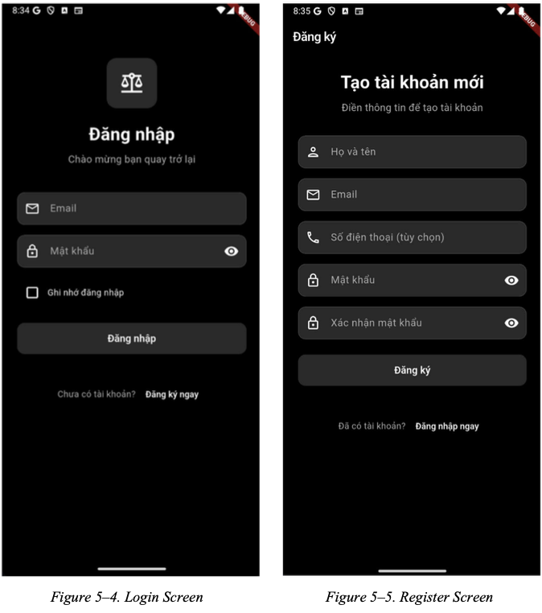
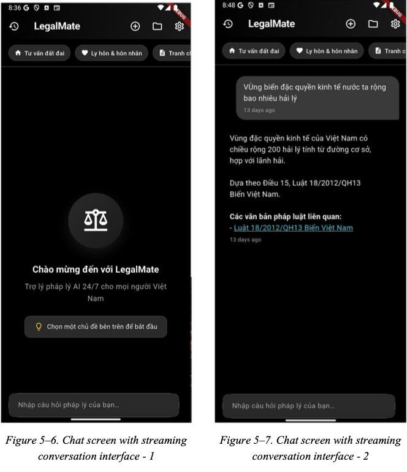
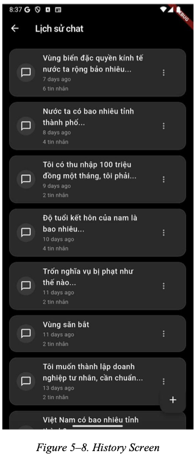
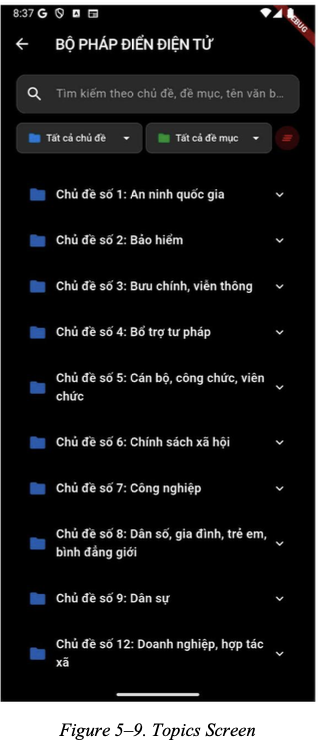

  

# Vietnamese Legal 3-Tier RAG Chatbot

A production-oriented AI legal assistant for Vietnamese law, powered by a **3-tier Retrieval-Augmented Generation (RAG)** architecture, hybrid retrieval, and Large Language Models.

---

## Overview

This project implements an end-to-end legal question-answering system designed for **Vietnamese legal documents**, which are inherently large, complex, and hierarchical.

The system combines:

- **3-tier hierarchical retrieval**
- **Hybrid search (BM25 + Vector Search)**
- **LLM-based reasoning and answer generation**

to deliver **accurate, context-aware, and grounded legal responses**.

---

## System Architecture

### 3-Tier RAG Pipeline

The system uses a progressive retrieval strategy:

1. **Category Search (Tier 1)**  
   - Identify the relevant legal domain  
   - Reduce search scope early  

2. **Document Filtering (Tier 2)**  
   - Select relevant legal documents within the category  
   - Improve efficiency and precision  

3. **Chunk-Level Retrieval (Tier 3)**  
   - Retrieve fine-grained text chunks  
   - Uses hybrid retrieval (BM25 + dense vector search + RRF)  

This pipeline significantly reduces irrelevant context and improves answer quality.

---

### Data Collection

### RAG Workflow

1. User query input  
2. Query enhancement using LLM  
3. Embedding generation  
4. 3-tier retrieval pipeline  
5. Context aggregation  
6. Answer generation with citations  

Additional capabilities:
- Query rewriting and expansion  
- Multi-turn conversation memory  
- Legal document number detection  

---

## Technologies

- **Language:** Python  
- **Framework:** FastAPI  
- **RAG Framework:** LangChain  
- **Vector Search:** FAISS, PostgreSQL (pgvector)  
- **Embedding Model:** BGE (BAAI/bge-m3)  
- **LLM:** Google Gemini  
- **Retrieval:** BM25 + Dense Retrieval + RRF  

---

## Key Features

-  3-tier hierarchical RAG pipeline  
-  Hybrid retrieval for better recall and precision  
-  Context-aware LLM-generated answers  
-  Query enhancement using LLM  
-  Exact legal document detection  
-  Conversation memory support  
-  Metadata-based citation tracing  

---

## Performance (Thesis Results)

- Category Accuracy: **87.5%**  
- Document Recall@5: **79.1%**  
- Chunk Recall@5: **67.0%**  
- Avg latency: **~9.6s**  
- Success rate: **100%**  

---

## UI

...

---

## Dataset (Important)
Due to legal and storage constraints, the full Vietnamese legal dataset is **not included** in this repository.

The system is designed to work with:
- Structured legal documents (law → articles → clauses)
- Preprocessed text chunks with metadata
- Embedding vectors stored in a vector database

=>  **A sample dataset or instructions** for dataset preparation will be added in **future updates**.

## Note
This repository focuses on system architecture and implementation of a production-level RAG pipeline.
To fully run the system, you may need:

- Legal dataset (the previous step)
- Vector database setup (PostgreSQL + pgvector)
- API keys for LLM services (In this project, I use Gemini API)

## About
This project was developed as part of a graduation thesis:
Development of an AI-based Legal Consultation System using Hierarchical RAG, Hybrid Retrieval, and Large Language Models